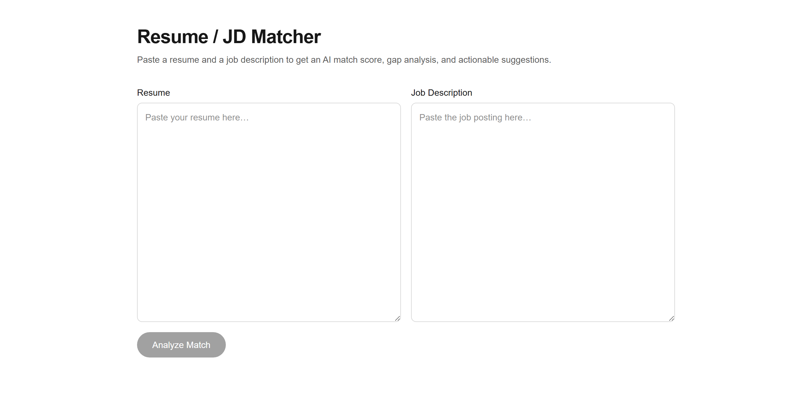
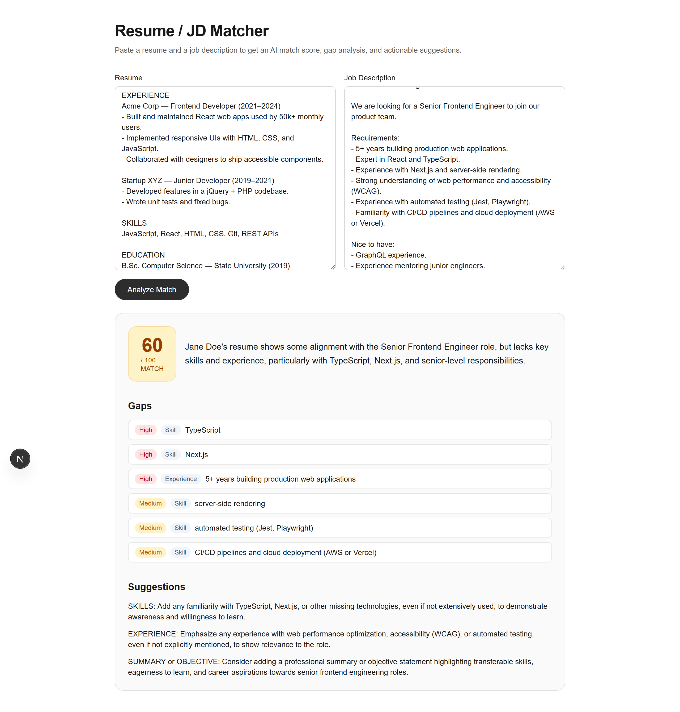

# Resume / JD Matcher

An AI-powered tool that compares a resume against a job description and returns a
match score, a gap analysis, and actionable suggestions. Built with Next.js and
the Groq API (free, fast LLM inference).

**🔗 Live demo:** [resume-jd-matcher-gamma.vercel.app](https://resume-jd-matcher-gamma.vercel.app/)


## Screenshots

| Paste resume + job description | AI match score, gaps & suggestions |
| :---: | :---: |
|  |  |

## What problem it solves

Job seekers often can't tell how well their resume lines up with a specific
posting. Paste both in, and the app scores the alignment, points out the
skills/keywords/qualifications the resume is missing, and suggests concrete
edits — without fabricating experience.

## How it works

1. Paste your resume and a job description into the two text areas.
2. Click **Analyze Match**.
3. Get a 0–100 score, a summary, a prioritized list of gaps, and suggestions.

The resume and job description are sent to a server-side API route, which calls
the Groq API in JSON mode. The response is validated against a Zod schema, so
the frontend always receives valid, typed JSON.

## Tech stack

- [Next.js](https://nextjs.org) (App Router) + TypeScript
- Tailwind CSS
- [Groq API](https://groq.com) via `groq-sdk`, model
  `llama-3.3-70b-versatile` (fast, free-tier inference well-suited to this
  text-analysis task)
- [Zod](https://zod.dev) for structured-output validation
- Deployed on [Vercel](https://vercel.com)

## Local setup

```bash
npm install
cp .env.example .env.local   # then edit .env.local and add your key
npm run dev
```

Open [http://localhost:3000](http://localhost:3000).

## Environment variables

| Variable         | Required | Description                                                        |
| ---------------- | -------- | ----------------------------------------------------------------- |
| `GROQ_API_KEY`   | Yes      | Free API key from [console.groq.com/keys](https://console.groq.com/keys) (no credit card). Server-side only — never exposed to the browser. |

On Vercel, set `GROQ_API_KEY` under **Project Settings → Environment
Variables** (Production + Preview) before deploying.

## Project structure

```
src/
  app/
    page.tsx              # client component: form + results
    layout.tsx
    api/match/route.ts    # POST handler — validates input, calls Claude
  components/
    MatchForm.tsx         # resume + job-description inputs
    ResultsPanel.tsx      # score + gaps + suggestions
    ScoreBadge.tsx        # color-coded 0–100 score
    ErrorBanner.tsx       # dismissible error alert
  lib/
    groq.ts               # server-only Groq client + model id
    prompt.ts             # system prompt + JSON format instructions
    schema.ts             # Zod schema + MatchResult type
```

## Limitations

- No authentication or database — every request is stateless.
- Analysis quality depends on the resume and job-description text you provide.

## License

MIT

## Author

Radu Voda — built as a portfolio project.
